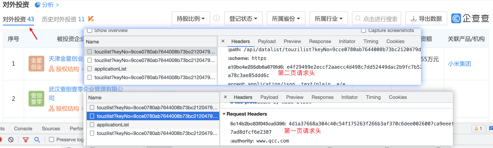
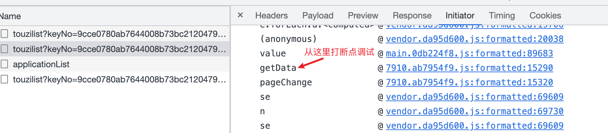
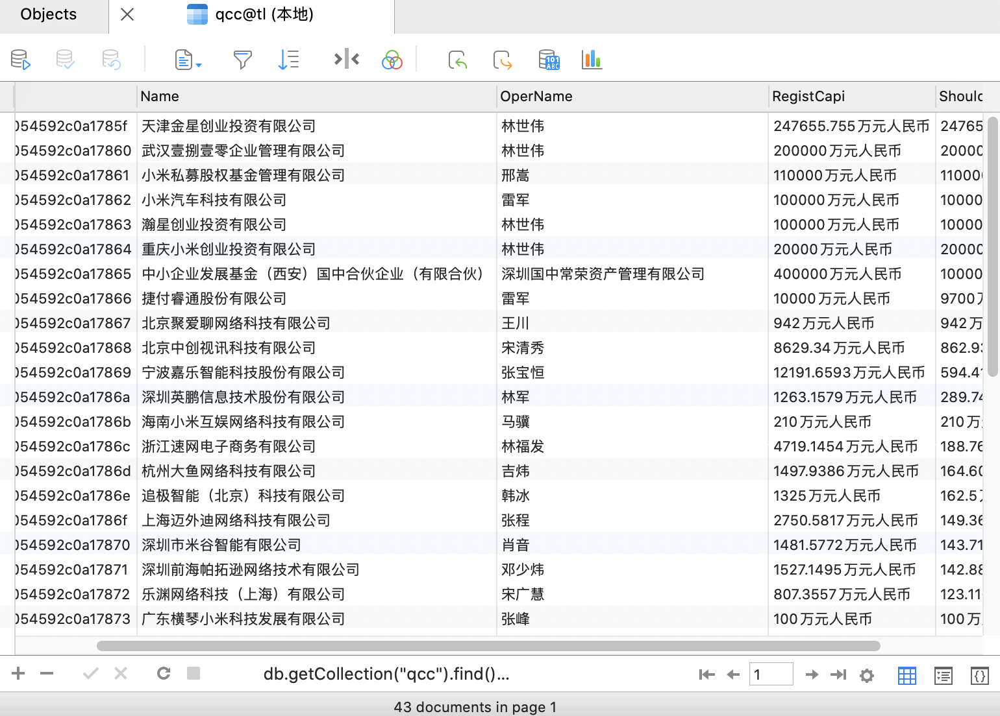

1）需要登录，点击页码查看接口；

有自定义的请求头，且 第一页，第二页，请求头不一样；



2）调试header 添加位置；

从 启动器查看；



单步调试找到 添加header的地方；


3）复写 header 的编码逻辑；

请求头key 编码：

```
1. 请求字符串全转小写，double，得到新字符串;
/api/datalist/touzilist?keyno=9cce0780ab7644008b73bc2120479d31&pageindex=3/api/datalist/touzilist?keyno=9cce0780ab7644008b73bc2120479d31&pageindex=3
2. 对新字符串的每个字符重新编码对应一个新值;
新值：iLAgiWL4Ligk4i46Lkgigk4Billv6lL88lik4iL1kNAAii41k618vrviAkLW6r1ALBlgvWlWl6iLAgiWL4Ligk4i46Lkgigk4Billv6lL88lik4iL1kNAAii41k618vrviAkLW6r1ALBlgvWlWl6

js 代码：
for (var e = (arguments.length > 0 && void 0 !== arguments[0] ? arguments[0] : "/").toLowerCase(), t = e + e, a = "", n = 0; n < t.length; ++n) {
var s = t[n].charCodeAt() % i.default.n;
a += i.default.codes[s]
}

t[n].charCodeAt() % i.default.n
i.default.n 是20；
码表：
{
    "n": 20,
    "codes": {
        "0": "W",
        "1": "l",
        "2": "k",
        "3": "B",
        "4": "Q",
        "5": "g",
        "6": "f",
        "7": "i",
        "8": "i",
        "9": "r",
        "10": "v",
        "11": "6",
        "12": "A",
        "13": "K",
        "14": "N",
        "15": "k",
        "16": "4",
        "17": "L",
        "18": "1",
        "19": "8"
    }
}

3. 把2中得到的新值做为key，/api/datalist/touzilist?keyno=9cce0780ab7644008b73bc2120479d31&pageindex=3{} 作为 msg，做hmac ；
71afe06424a6e111a6e78dba0ec651bbb6328e081c3c3199461770fe8337a8690a829a3cf27a1119139c3823f415d1f9a6af091b7bfbf96b8d7e498606e18ec0

4. 从hamc值的 第8位开始，取20位 作为请求头 key；
24a6e111a6e78dba0ec6
```

请求头值 编码：

```
1.js 代码：
function() {
  var e = arguments.length > 1 && void 0 !== arguments[1] ? arguments[1] : {}
  , t = arguments.length > 2 && void 0 !== arguments[2] ? arguments[2] : ""
  , a = (arguments.length > 0 && void 0 !== arguments[0] ? arguments[0] : "/").toLowerCase()
  , n = JSON.stringify(e).toLowerCase();
  return (0,
  i.default)(a + "pathString" + n + t, (0,
  s.default)(a))
}

参数arguments:
{
    "0": "/api/datalist/touzilist?keyno=9cce0780ab7644008b73bc2120479d31&pageindex=3",
    "1": undefined, # 请求体，get请求无
    "2": "6827a6649ad688dc2f99ff318e5d4b74" # 这是指纹信息 window.tid
}

2. 思路同请求头差不多，取 /api/datalist/touzilist?keyno=9cce0780ab7644008b73bc2120479d31&pageindex=3/api/datalist/touzilist?keyno=9cce0780ab7644008b73bc2120479d31&pageindex=3 编码后的值 为key，msg 为 /api/datalist/touzilist?keyno=9cce0780ab7644008b73bc2120479d31&pageindex=3pathString{}6827a6649ad688dc2f99ff318e5d4b74；
做hmac，取hmac值作为请求头的值；

a19fca9f3200b208cbfce9339eb7391f35f4282e7c5a4650a4d4823306c0935f1b7c11860e84fe48fbf371dd1c4b0bd80e2ad22e933f845e7c5d1287676205bb
```

4）粘贴登录后的cookie，用python请求；

5）数据；

