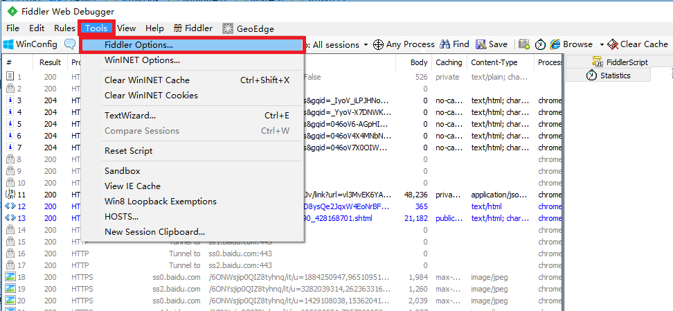
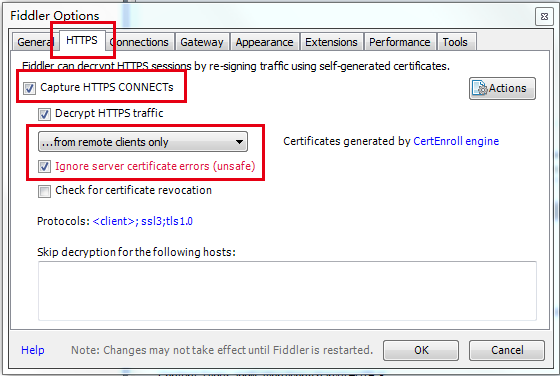
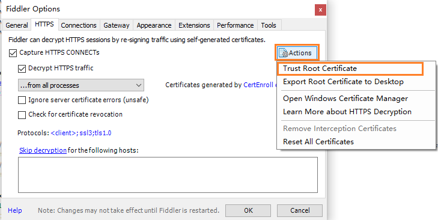
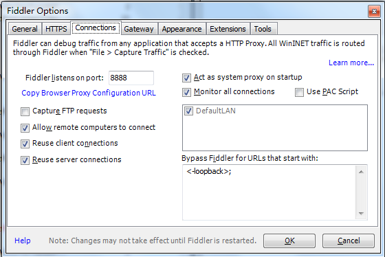
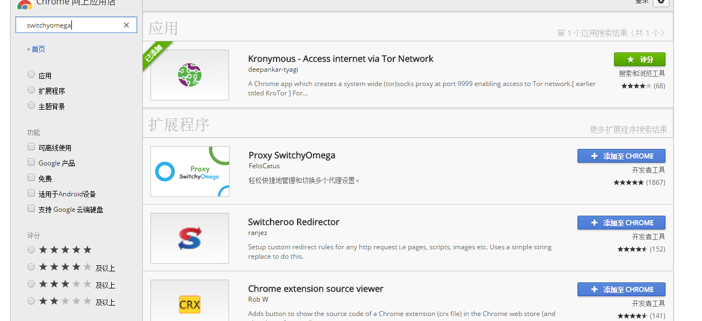

# HTTP代理神器Fidder

Fiddler不但能截获各种浏览器发出的HTTP请求, 也可以截获各种智能手机发出的HTTP/HTTPS请求。 Fiddler能捕获IOS设备发出的请求，比如IPhone, IPad, MacBook. 等等苹果的设备。 同理，也可以截获Andriod，Windows Phone的等设备发出的HTTP/HTTPS。

## 工作原理

Fiddler 是以代理web服务器的形式工作的，它使用代理地址:127.0.0.1，端口:8888。


### Fiddler抓取HTTPS设置

- 启动Fiddler，打开菜单栏中的 Tools > Fiddler Options，打开“Fiddler Options”对话框。

  

- 对Fiddler进行设置：打开工具栏->Tools->Fiddler Options->HTTPS

  

  

选中Capture HTTPS CONNECTs，因为我们要用Fiddler获取手机客户端发出的HTTPS请求，所以中间的下拉菜单中选中from remote clients only。选中下方Ignore server certificate errors.



- 配置Fiddler允许远程连接

Fiddler 主菜单 Tools -> Fiddler Options…-> Connections页签，选中Allow remote computers to connect。



### Fiddler 如何捕获Chrome的会话

- switchyomega安装插件

翻墙工具：
http://www.ishadowsocks.org/ https://github.com/getlantern/lantern

打开网址 https://chrome.google.com/webstore/search/switchyomega?hl=zh-CN



点击 深蓝色字体“添加至CHROME”


### Fiddler 如何捕获Firefox的会话

能支持HTTP代理的任意程序的数据包都能被Fiddler嗅探到，Fiddler的运行机制其实就是本机上监听8888端口的HTTP代理。 Fiddler2启动的时候默认IE的代理设为了127.0.0.1:8888，而其他浏览器是需要手动设置的，所以将Firefox的代理改为127.0.0.1:8888就可以监听数据了。 Firefox 上通过如下步骤设置代理 点击: Tools -> Options, 在Options 对话框上点击Advanced tab - > network tab -> setting.

## Fiddler如何捕获HTTPS会话

默认下，Fiddler不会捕获HTTPS会话，需要你设置下， 打开Fiddler Tool->Fiddler Options->HTTPS tab


选中checkbox， 弹出如下的对话框，点击"YES"


点击"Yes" 后，就设置好了。

### Fiddler的基本界面

看看Fiddler的基本界面


特别注意： 遇到这个Click请点击Click


## Fiddler强大的Script系统

Fiddler包含了一个强大的基于事件脚本的子系统，并且能使用.net语言进行扩展。 官方的帮助文档:

```
http://www.fiddler2.com/Fiddler/dev/ScriptSamples.asp
```

首先先安装SyntaxView插件，Inspectors tab->Get SyntaxView tab->Download and Install SyntaxView Now... 如下图


安装成功后Fiddler 就会多了一个Fiddler Script tab，如下图：


在里面我们就可以编写脚本了， 看个实例让所有cnblogs的会话都显示红色。 把这段脚本放在OnBeforeRequest(oSession: Session) 方法下，并且点击"Save script"

```python
if (oSession.HostnameIs("www.cnblogs.com")) {
　　oSession["ui-color"] = "red";
}
```

这样所有的cnblogs的会话都会显示红色。