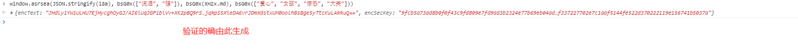
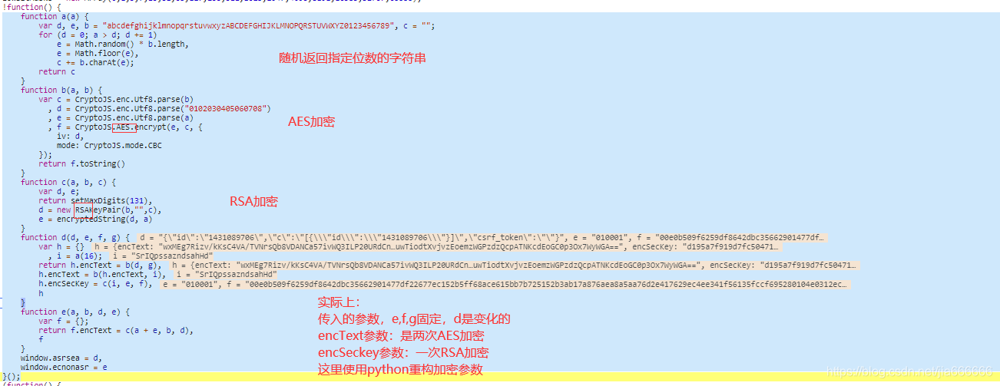

##### 目的

```bash
目的：JS逆向的学习与交流
目标：分析某云音乐网站中加密参数
目标网址：https://music.163.com/
```

##### 思路分析

一、内容概览


二、请求参数分析






```python
#!/usr/bin/env python
# -*- coding: utf-8 -*-
# @Time    : 2021年10月31日 0031 21:21:15
# @Author  : 何老师
# @File    : 网易云AES与RSA解析.py
import requests
import random
from Crypto.Cipher import AES
import base64
from binascii import hexlify


def RandomString(a):
    '''
    随机返回16位字符串 JS代码里面的a(16)
    :param a:
    :return:
    '''
    string = 'abcdefghijklmnopqrstuvwxyzABCDEFGHIJKLMNOPQRSTUVWXYZ0123456789'
    randomStr = random.sample(string, a)
    return "".join(randomStr)


def AESEncrypt(text, key):
    '''
    AES加密
    :param text: 需要加密的密文
    :param key: 秘钥
    :return:
    '''
    iv = b'0102030405060708'
    pad = 16 - len(text) % 16
    text = text + chr(2) * pad
    # 创建 AES对象
    encryptor = AES.new(key.encode(), AES.MODE_CBC, iv)
    # AES 进行加密
    encryptor_str = encryptor.encrypt(text.encode())
    result = base64.b64encode(encryptor_str).decode()
    return result


def AES2(text, random_str):
    '''
    第二次AES加密
    :param text: 加密的密文
    :param random_str: 随机16位字符串
    :return:
    '''
    first_aes = AESEncrypt(text, key='0CoJUm6Qyw8W8jud')
    second_aes = AESEncrypt(first_aes, random_str)
    return second_aes


def RSA1(text):
    '''
    RSA加密
    :param text: 需要加密的密文
    :return:
    '''
    f = "00e0b509f6259df8642dbc35662901477df22677ec152b5ff68ace615bb7b725152b3ab17a876aea8a5aa76d2e417629ec4ee341f56135fccf695280104e0312ecbda92557c93870114af6c9d05c4f7f0c3685b7a46bee255932575cce10b424d813cfe4875d3e82047b97ddef52741d546b8e289dc6935b3ece0462db0a22b8e7"
    e = "010001"
    text = text[::-1]
    # 返回二进制数据的16进制表示
    result = pow(int(hexlify(text.encode()), 16), int(e, 16), int(f, 16))
    return format(result, 'x').zfill(131)


text = '{"ids":"[1877996649]","level":"standard","encodeType":"aac","csrf_token":""}'
random_str = RandomString(16)
params = AES2(text, random_str)
encSecKey = RSA1(random_str)

url = 'https://music.163.com/weapi/song/enhance/player/url/v1?csrf_token='
headers = {
    'user-agent': 'Mozilla/5.0 (Windows NT 10.0; Win64; x64) AppleWebKit/537.36 (KHTML, like Gecko) Chrome/95.0.4638.54 Safari/537.36',
    'referer': 'https://music.163.com/',
    'cookie': '__root_domain_v=.163.com; _qddaz=QD.466535067273443; _iuqxldmzr_=32; _ntes_nnid=db55e634c314aaed3aae6d87761a3f6a,1635493765493; _ntes_nuid=db55e634c314aaed3aae6d87761a3f6a; NMTID=00Oq6nC2xJ6iaD4c06NiKV4-Q9zytUAAAF8ywcZKg; WNMCID=hnvirt.1635493766236.01.0; WEVNSM=1.0.0; WM_TID=AB3rkaOR9WBAQEFRVAJqeyXR7VMUerg%2F; JSESSIONID-WYYY=SiEroNtPcBl72CI6885rWynitg%2BjRTBEhniB%2FGEFcPyPm9i1cbNRRaKA4pqMlqMSWZsOVOcp23EsZATtPEtXVCstiSS%2FyGEigCJvCKTh4xlkNRRb8fmPCm9G5sOAS7WGfQa%2FqsC65ZTchG5KorFfb%5CQRDeZe%2F%2BE160fKi%2BIXuD5YN7tY%3A1635688300323; WM_NI=%2FmMrX2gwjge%2F62TnGQYWwV8uTsDThUSlUJ1AcZLEZD60AiDgkbD17h9XjZBXpRJJZtgR%2BNrsJSFelCl0dyyR%2B0rR83D35DCqTh%2F2gl5glEn9u7Jezt4ozKpSyVlKIgHyak4%3D; WM_NIKE=9ca17ae2e6ffcda170e2e6eed1b76b9c94a6a5d66bb38a8fb7c14b938e8abab540a687bc98d75a87bb96d2aa2af0fea7c3b92aedb38393db3aa5a9a688e825f6ee9c8fc65b9b89b9b7bb7f98ad8cb5eb5f91b49babb44ba18684a6d950f6f08f8ac76da9be8cd2b664fb88a6bbc154b48e86abd980a58ee5aff1798a8d8a86ef49b0f0ac9afc5ae9f0beb3bb3988edfba5c27b98b8e1d3e668f7b9a4a6ed33b7e98686f980f8b1b6acf359bb8aa4accc6d8ca7af8cb737e2a3',
}
data = {
    'params': params,
    'encSecKey': encSecKey,
}
response = requests.post(url, headers=headers, data=data).json()
print(response)
```

